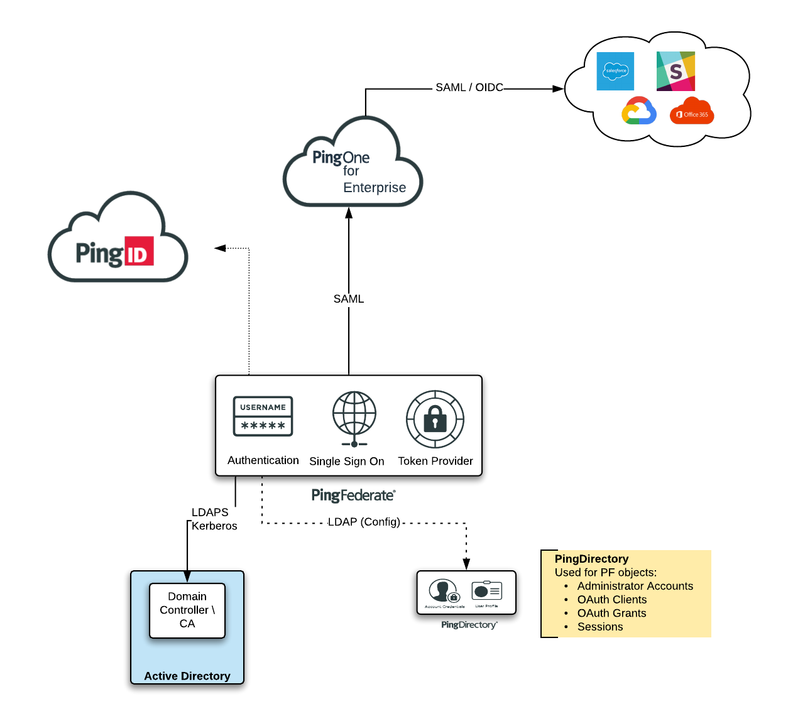

This profile provides a configuration of Ping software that can be used to implement a WorkForce solution.

## Deployment
* Copy the `docker-compose.yaml` and `env_vars` files to a folder
* Modify the `env_vars` file to match your environment
* Launch the stack with `docker-compose up -d`

## Post-Deployment Steps
It's not possible to fully automate the implementation of this Solution. There are additional steps needed to be performed manually after things are running:

### Active Directory
This Profile is configured to use an Active Directory instance that has been pre-built and hosted Ping's Scalr \ AWS environment.  

If you'd like to use your own AD Forest, you will need to change the `Datastore` and `Password Credential Validator` to reflect your information.  

If you would like to **build** your own, you can use the Commands listed in the [ActiveDirectory](ActiveDirectory) section of this repo. 

### PingOne for Enterprise
In order to connect this PF instance to PingOne for Enterprise, you will need a P14E tenant. This process is somewhat automated through a Wizard, but cannot be automated in this Solution Profile.

In PF, go to `System --> Connect to PingOne for Enterprise` and select the `Sign on to PingOne to get your activation key` link (https://admin.pingone.com/web-portal/cas/config/idpng/pingFedActivate).  

Logon to PingOne for Enterprise and copy the Activation Key that should be presented. This key should be pasted into PF to begin the integration process.

**Notes:**
* When prompted to for a Directory Server, Select `Yes` and press the `Begin` button to connect the one that is created as part of this Solution
* Uncheck the `Outbound Provisioning` checkbox if you don't want to configure this.
* For the Extended Properties -- type `Basic` or `Passwordless` (depending on what journey you want a User Authentication to take)
* Use the `Default Policy Contract` to Map values into the Connection

### PingID for Self Service Password Reset
The HTML Form adapter stores the PID Properties as an encrypted JWT, unlike the PID Adapter that uses a base64 encoding. This means that you need to manually import your PID Properties file into the HTML Form.

**Note**: The PID Properties upload is in the `Advanced` Properties of the Adapter, not near the SSPR settings.
  
You will also need to enable PingID as the SSPR method -- the Adapter won't save without the PID Properties. 

---
## Configuration

To access the Admin UI for PF go to:  
<https://{{PF_HOSTNAME}}:9999/pingfederate>

Credentials:  
`Administrator` / `2FederateM0re`

This configuration includes:

### Adapters
* HTML Form
* Identifier-First (Passwordless)
* Kerberos
* PingID

### PingID - Special Considerations
The PingID adapter uses the secrets from your PingID tenant to create the proper calls to the service. As such, storing those values in a public location, such as GitHub, sound be considered **risky**.

For this Profile, you can place the `base64` encoded text from a `pingid.properties` file that will be placed into the PingID Adapter settings 

### Authentication Policy
Extended Property Selector
  * Basic (HTML Form --> PingID)
  * Kerberos (Kerberos --> PingID)
  * Passwordless (ID-First --> PingID)

The Authentication Experience is controlled by setting the `Extended Properties` on the Application.  

Authentication API
* HTML Form --> AuthN API Explorer  

### Extended Properties
* `Basic` (Plain HTML Form --> PingID)
* `Kerberos` (Kerberos --> PingID)
* `Passwordless` (ID-First --> PingID)
* _Anything Else_ (AuthN API Explorer)

### Applications
Two applications are pre-wired:

**SAML:**  
<https://${PF_BASE_URL}/idp/startSSO.ping?PartnerSpId=Dummy-SAML>

**OAuth \ OIDC:**   
Flows:
* AuthZ Code
* Implicit
* Refresh Tokens

`Issuer` == ${PF_BASE_URL}  

`client_id` == PingLogon  
`client_secret` == 2FederateM0re

**Client Credential**  
`client_id` == cc_secret_client  
`client_secret` == 2FederateM0re

**Introspect**  
`client_id` == PingIntrospect  
`client_secret` == 2FederateM0re

### Users
If you are using the AD Configuration in this repo, the following users can be used to test with:

`pinguser1` / `2FederateM0re`  
`pinguser2` / `2FederateM0re`

### **Windows Client - Integrated Authentication (Kerberos)**  
If you want to demo Kerberos, you can do that too:

* Point your Windows OS DNS Client to the Domain Controller IP Address
* Join the Windows client to your Domain
* Logon to the Windows Client with a Domain User
* Add your PingFed host to the Intranet Zone of IE 
  * (You can do this with Powershell -- [100-Configure-IntranetSites-in-IE.ps](ActiveDirectory/100-Configure-IntranetSites-in-IE.ps))
* If you want to use Edge -- Import the IE settings (Settings --> Import --> IE)
* Set your PF Connection --> Extended Properties to `Kerberos`
* If you see a pop-up -- you've missed a step in the configuration